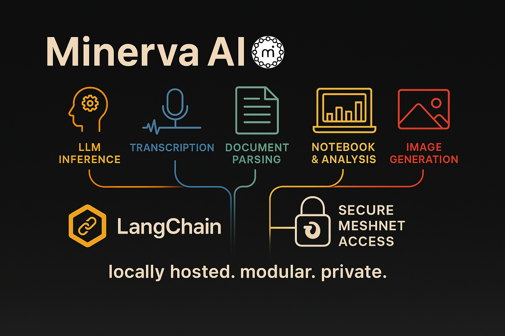

<table>
  <tr>
    <td></td>
    <td>&nbsp;&nbsp;</td>
    <td>&nbsp;&nbsp;<h1>Minerva</h1></td>
  </tr>
</table>

Minerva is a self-hosted, GPU-accelerated AI stack designed for private, high-performance natural language processing and data workflows. Built entirely with Docker, it integrates Ollama, Whisper, JupyterLab, Stable Diffusion, LangChain-ready services, and secure Tailscale Meshnet access into a unified, modular system. This setup enables fully local LLM inference, audio transcription, document parsing, charting, and automation — without exposing any data to the cloud. Minerva was engineered for analysts, developers, and power users who want full control over their AI tools, infrastructure, and privacy.




---

## Quick Start

1. **Clone the Repository:**

   ```bash
   git clone https://github.com/hoonywise/minerva.git
   cd minerva
   ```

2. **Set Up Environment Variables:**
   - Create a `.env` file and populate it with your configuration.

3. **Start the Containers:**

   ```bash
   docker compose up -d
   ```

4. **Access Services:**
   - WebUI: `http://localhost/` (**Your Tailscale DNS**)
   - LangChain: `http://localhost:5000/langchain/health`

---

## 🌟 Features

- Robust Retrieval-Augmented Generation (RAG)
- Web search integration (Google API, searxng)
- Interactive computing with Jupyter Lab
- Advanced document parsing via Apache Tika
- High-quality image generation using Stable Diffusion
- Workflow automation with OpenWebUI Pipelines
- Secure remote access through Tailscale VPN
- Optimized GPU performance (NVIDIA RTX)
- Multiple AI services seamlessly integrated

---

## 🛠️ Components & Models

### Local AI Models

- **Minerva:** QWEN2.5:14b
- **Minerva-Coder:** QWEN2.5-coder:14b
- **Minerva-Vision:** minicpm-v\:latest
- **Embedding:** nomic-embed-text
- **Reranker:** mixedbread-ai/mxbai-rerank-base-v1
- **Speech-to-Text:** whisper-large-v3-turbo
- **Text-to-Speech:** Kokoro-TTS
- **Image Generation:** Stable Diffusion (DreamShaper XL)
- **Interactive Computing:** JupyterLab
- **Document Processing:** Apache Tika

### Cloud API Integrations

**Pre-configured External Models (OpenRouter & GroqCloud):**

- Various free models including deepseek, google/gemini, llama-3, mistral, mixtral, qwen, and others

---

## GPU Requirements

Minerva leverages GPU acceleration for optimal performance. While most modern NVIDIA GPUs with CUDA support will function adequately, an **NVIDIA RTX 4080** (used by the repository maintainer) or higher is recommended to ensure smooth performance, especially for large language models and image generation tasks.

---

## Architecture Overview

```[User via Tailscale (HTTPS)]
|
└───▶ (your tailscale dns)
         ├── :443   → Nginx → Open WebUI
         ├── :11434 → Ollama API
         ├── :8888  → JupyterLab
         ├── :7860  → Stable Diffusion
         └── Additional services (Tika, Pipelines, LangChain, etc.)
```

---

## Installation

### Step 1: Environment Setup

Create a `.env` file in the project root with your API keys and configuration:

```HUGGINGFACE_HUB_TOKEN=
TAILSCALE_AUTH_KEY=
TS_HOSTNAME=minerva
GOOGLE_API_KEY=
GOOGLE_CSE_ID=
FINNHUB_API_KEY=
OLLAMA_API_KEY=
SD_WEBUI_AUTH=
KOKORO_API_KEY=
GROQ_API_KEY=
OPENROUTER_API_KEY=
GOOGLE_CLIENT_ID=
GOOGLE_CLIENT_SECRET=
```

### Step 2: Docker Compose

Use the provided `docker-compose.yml` to orchestrate your services.

### Step 3: Run Docker Compose

```sh
docker compose up -d
```

Docker Compose will build and run all containers:

- **NGINX**: Reverse proxy managing HTTPS access.
- **Ollama (Open WebUI)**: AI assistant with RAG/Web Search.
- **Stable Diffusion**: DreamShaper XL-powered image generation.
- **Jupyter Notebook**: Interactive Python environment.
- **Tika Server**: Document parsing and content extraction.
- **Kokoro-TTS**: High-quality Text-to-Speech.
- **Redis**: Backend for session and caching management.
- **Pipelines**: Workflow automation.

## Component Details

### Ollama Container

- **Model**: Qwen2.5:14B pre-loaded
- **Embedding**: Nomic Embed Text
- **Optimizations**: Configured GPU, optimized batch size, context window (8192 tokens)
- **Startup script**: Automatic model downloads and ChromaDB cleanup (`ollama.sh`)

### Stable Diffusion

- **Default Model**: DreamShaper XL
- **Performance**: GPU accelerated with xformers
- **Startup script**: Automatic model checks and performance optimizations (`stable-diffusion.sh`)

### Jupyter Lab

- Accessible via `/jupyter/`
- Pre-installed with essential Python packages
- Remote access enabled without authentication (secured via Tailscale)

### Nginx Reverse Proxy

- Routes all services securely over HTTPS
- Manages WebSockets, OAuth2 callbacks, and specific tool endpoints
- Configured for optimal performance (`nginx.conf`)

---

## Tailscale Endpoint Setup

### Secure AI Stack Deployment Using Docker, Nginx, and Tailscale

This guide details how to securely expose multiple containerized AI services—**Open WebUI (Ollama)**, **Jupyter Lab**, and **Stable Diffusion**—via Tailscale using Docker Compose, Nginx as a reverse proxy, and socat for port forwarding. This configuration ensures secure, easy-to-manage, and isolated access through your private Tailnet.

---

### ✅ What You'll Achieve

- **Securely** expose AI services only within your Tailscale network.
- Utilize **Docker containers** for easy management and scalability.
- Route multiple services using a single domain with different ports.
- Automate startup with robust checks to ensure service availability.

---

### ⚙️ Key Components

- **Docker & Docker Compose**
- **Tailscale** for private VPN access
- **Nginx** as reverse proxy (optional, for SPA/WebUI hosting)
- **socat** for reliable internal port forwarding

### 🚀 Step-by-Step Setup

#### Step 1: Docker Compose Configuration

Define your services (`docker-compose.yml`):

```yaml
version: '3.8'
services:
  nginx-proxy:
    image: nginx:latest
    container_name: nginx-proxy
    volumes:
      - ./nginx.conf:/etc/nginx/nginx.conf
    networks:
      - minerva-network
    ports:
      - "127.0.0.1:80:80"

  ollama-container:
    image: open-webui:latest
    container_name: ollama-container
    networks:
      - minerva-network
    ports:
      - "127.0.0.1:11434:11434"

  jupyter-notebook:
    image: jupyter-minerva:custom
    container_name: jupyter-notebook
    networks:
      - minerva-network
    ports:
      - "127.0.0.1:8888:8888"
    environment:
      - JUPYTER_ENABLE_LAB=1
      - JUPYTER_TOKEN=
    command: >
      jupyter lab
      --NotebookApp.base_url=/jupyter/
      --NotebookApp.allow_remote_access=true
      --NotebookApp.token=''

  stable-diffusion:
    image: stable-diffusion:latest
    container_name: stable-diffusion
    networks:
      - minerva-network
    ports:
      - "127.0.0.1:7860:7860"

networks:
  minerva-network:
```

#### Step 2: Configure `tailscale.sh` (Critical Script)

Enabling HTTPS: <https://tailscale.com/kb/1153/enabling-https>
Use OpenSSL to create certicates for iOS devices using server.key: <https://docs.openssl.org/master/>

This script runs inside the Tailscale Docker container:

- Installs necessary tools (`socat`)
- Waits until services are reachable
- Sets up port forwarding
- Ensures robust service availability before exposure via Tailscale

**Important Fix**: Use `--bg` to ensure multiple `tailscale serve` commands work correctly.

```sh
tailscale serve --bg --https=11434 http://127.0.0.1:11434
tailscale serve --bg --https=8888  http://127.0.0.1:8888
tailscale serve --bg --https=7860  http://127.0.0.1:7860
tailscale serve --bg --https=443   http://127.0.0.1:80
```

This order and usage of `--bg` is essential!

---

## New Feature: LangChain Integration

We have successfully integrated LangChain into the Minerva setup. This addition allows for enhanced natural language processing and model interaction via a dedicated API. LangChain is connected to Ollama to generate text responses using the latest local AI models.

### Key Benefits

- Direct integration with Ollama for text generation.
- Easy API access via Tailscale.
- Supports multiple AI models, including Qwen2.5:14b.
- Exposed through NGINX for secure remote access.

### How to Use LangChain

#### Direct API Call Example (PowerShell)

```
curl.exe -X POST http://localhost:5000/langchain/generate -H "Content-Type: application/json" -d '{"prompt": "Hello, Minerva!", "model": "qwen2.5:14b"}'
```

#### Python API Call Example

```python
import requests

url = "http://localhost:5000/langchain/generate"
data = {
    "prompt": "Hello, Minerva!",
    "model": "qwen2.5:14b"
}
response = requests.post(url, json=data)
print(response.json())
```

### API Endpoints

| Endpoint              | Description                             |
| --------------------- | --------------------------------------- |
| `/langchain/health`   | Health check for the LangChain service  |
| `/langchain/generate` | Generate text based on the given prompt |

### Configuration Details

- NGINX proxies requests from `/langchain/` to the LangChain container.
- Access via Tailscale at: `http://localhost:5000/langchain/`
- Supports multiple models, default: `qwen2.5:14b`.
- Refer to /docker/langchain/app.py for Flask API configuration.

### Troubleshooting

If you encounter a 404 error when accessing the API, ensure that the NGINX configuration correctly forwards requests to the LangChain container.

---

## 🧠 Critical Lessons Learned

- **Multiple Tailscale Ports:**
  - Tailscale CLI (`tailscale serve`) doesn't naturally handle multiple bindings without the `--bg` flag.
  - Serve port `443` last to avoid conflicts or silent failures.

- **Port Forwarding Reliability:**
  - Using `socat` with a robust retry mechanism ensures services are consistently reachable, preventing race conditions during container startup.

- **SPA and Reverse Proxy Interactions:**
  - Serving a Single Page Application (SPA) through Nginx requires careful routing to avoid sub-path conflicts.

- **LangChain Integration and API Routing:**
  - When integrating LangChain behind a reverse proxy, ensure Flask route definitions match NGINX proxy paths explicitly; mismatches can cause confusing 404 Not Found errors.

---

## 🎯 Final Access URLs

| Service          | URL                                               |
|------------------|---------------------------------------------------|
| WebUI (NGINX)    | `http://localhost/`             |
| Ollama API       | `http://localhost:11434/`       |
| Jupyter Lab      | `http://localhost:8888/jupyter/`|
| Stable Diffusion | `http://localhost:7860/`        |

---

## Maintenance and Updates

- Update container configurations via Docker Compose.
- Adjust optimizations in respective startup scripts.
- Commit ollama-container after you configure the Webui admin panel settings
- Monitor services through logs:

  ```sh
  docker compose logs -f
  ```

---

## 📝 Closing Notes

Minerva is designed as a portable AI stack with security and local control in mind, ideal for private users, developers, and teams.  I tried my best to structure and design the stack so that it can be deployed on any machine without much fiddling with the configuration.  In theory, only thing you will have to set up is the .env file with your tokens and api keys, and Tailscale DNS and iOS certificates via OpenSSL (optional), should you want to access HTTPS via iOS devices.

This documentation outlines a structured and secure approach to deploying a sophisticated AI stack, perfect for personal use or small teams looking for enhanced privacy and customization.

Also, it covers a real-world scenario that fills gaps in current official documentation of Tailscale and various AI services, providing an end-to-end secure configuration to safely expose containerized applications internally through a Tailscale VPN.

**Enjoy your secure, private, and accessible AI stack!**

---

## 🧩 Built With

- [Ollama](https://ollama.com)
- [Open WebUI](https://github.com/open-webui/open-webui)
- [JupyterLab](https://jupyter.org)
- [Stable Diffusion WebUI (AUTOMATIC1111)](https://github.com/AUTOMATIC1111/stable-diffusion-webui)
- [Tailscale](https://tailscale.com)
- [Apache Tika](https://tika.apache.org/)
- [LangChain](https://www.langchain.com/)

All components are open source and distributed under their respective licenses.

---

## 🧑‍💼 Maintainer

Created and maintained by: [@hoonywise](https://github.com/hoonywise)  
Contact: [hoonywise@proton.me](mailto:hoonywise@proton.me)

For questions, suggestions, or contributions, feel free to reach out or open a GitHub issue.

---

## 📜 License

This repository is distributed for personal, educational, and institutional use. It combines multiple open-source tools, each governed by their own licenses (Apache 2.0, MIT, etc.).

You are welcome to:

- Use and modify this stack in your own environment
- Share it with your team or institution
- Fork this repository and contribute enhancements

You may **not**:

- Resell or commercially distribute this stack as a whole without permission
- Misrepresent authorship of the original components

> 🔗 Please retain proper attribution to the open-source projects referenced in this stack.

For full license details of each component, see their respective repositories:

- [Ollama License](https://github.com/ollama/ollama/blob/main/LICENSE)
- [Open WebUI License](https://github.com/open-webui/open-webui/blob/main/LICENSE)
- [LangChain License](https://github.com/langchain-ai/langchain/blob/master/LICENSE)
- [JupyterLab License](https://github.com/jupyterlab/jupyterlab/blob/main/LICENSE)
